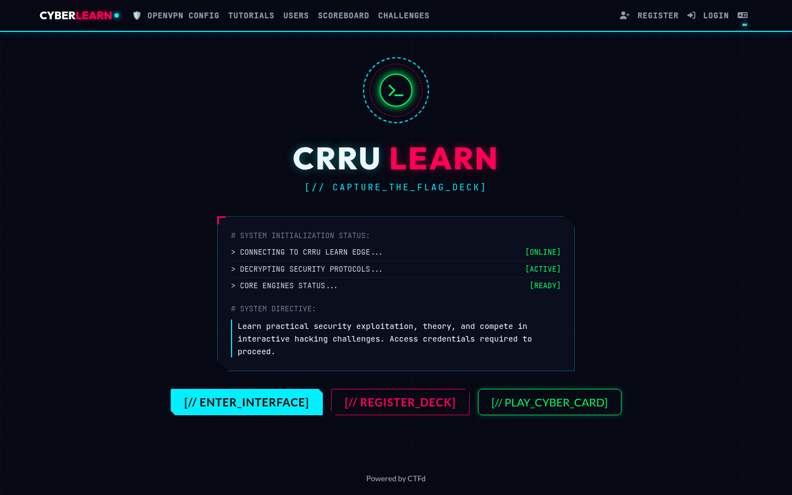
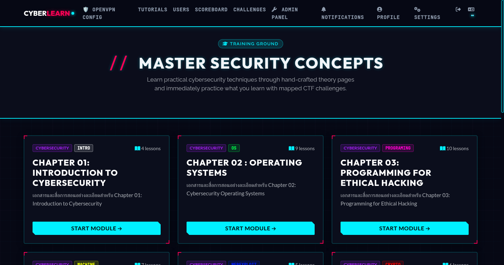
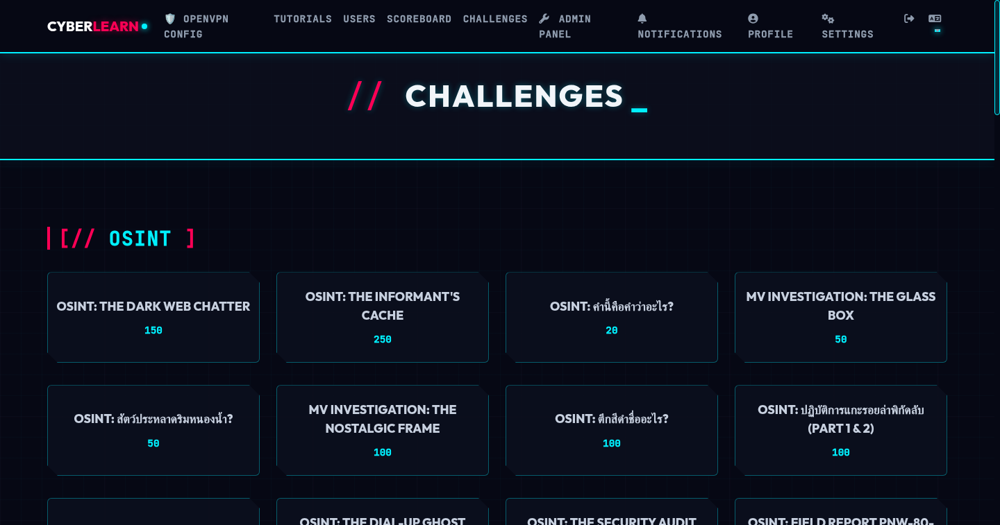
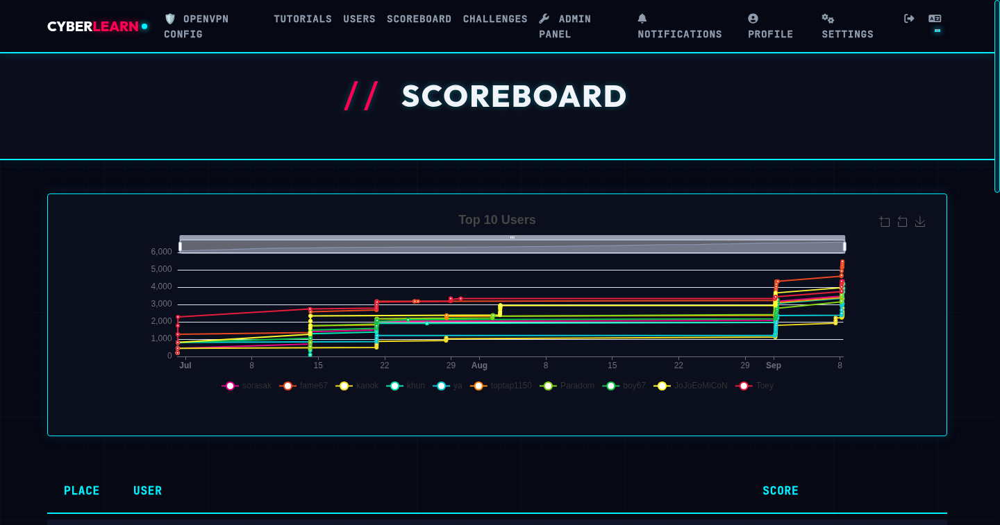

# 🏴 CRRU CTF Platform

> Customized **Capture The Flag** learning platform for **Chiang Rai Rajabhat University (CRRU)**  
> Built on top of [CTFd](https://ctfd.io/) with custom plugins, lessons, and Docker-based lab environments.

---

## 🎯 Overview

CRRU CTF is a hands-on cybersecurity learning system for students. It provides:

- 📚 **Interactive Lessons** — Step-by-step cybersecurity tutorials (Networking, Web, Crypto, RE, Exploitation)
- 🐳 **Dynamic Labs** — Per-student Docker container labs via [ctfd-whale](https://github.com/glzjin/CTFd-Whale)
- 🏆 **CTF Challenges** — Weekly challenges with auto-scoring and leaderboard
- 🔒 **VPN Access** — OpenVPN integration for isolated lab access

---

## 📸 Screenshots

| Home | Tutorials |
|:---:|:---:|
|  |  |

| Challenges | Scoreboard |
|:---:|:---:|
|  |  |

---

## 🏗️ Architecture

```
┌─────────────────────────────────────────────────┐
│                  Node A (Local)                  │
│  ┌──────────┐  ┌───────┐  ┌──────────────────┐  │
│  │  CTFd    │  │ Redis │  │    MariaDB         │  │
│  │ (Flask)  │  └───────┘  └──────────────────┘  │
│  └────┬─────┘                                    │
│       │ Docker Network                           │
│  ┌────▼──────┐  ┌───────────┐                   │
│  │  nginx    │  │ ctfd-whale │  (lab containers) │
│  └────┬──────┘  └───────────┘                   │
│       │ Cloudflare Tunnel                        │
└───────┼─────────────────────────────────────────┘
        │
        ▼  Internet
┌───────────────────┐
│  Node B (Lab)     │
│  OpenVPN Server   │
│  FRP Server       │
└───────────────────┘
```

---

## ⚙️ Quick Start

### Prerequisites

- Docker & Docker Compose v2
- Git

### 1. Clone & Configure

```bash
git clone https://github.com/bosskitti/crru_ctf.git
cd crru_ctf
cp .env.example .env
# Edit .env with your values — see Environment Variables below
```

### 2. Start the Stack

```bash
docker compose up -d
```

### 3. Initial Setup

Visit `http://localhost:8000` and complete the CTFd setup wizard.

---

## 🔧 Environment Variables

Copy `.env.example` to `.env` and fill in:

| Variable | Description | Required |
|---|---|---|
| `SECRET_KEY` | Flask secret key | ✅ |
| `DATABASE_URL` | MariaDB connection string | ✅ |
| `REDIS_URL` | Redis connection string | ✅ |
| `CLOUDFLARE_TUNNEL_TOKEN` | Cloudflare Tunnel token | ✅ |
| `OPENVPN_REMOTE_HOST` | Node B public IP/hostname | ✅ |
| `OPENVPN_REMOTE_PORT` | Node B OpenVPN port (default: `1194`) | ✅ |
| `FRP_TOKEN` | FRP authentication token | optional |

> ⚠️ **Never commit `.env` to version control.** Use `.env.example` as a template only.

---

## 📁 Repository Structure

```
crru_ctf/
├── CTFd/                    # CTFd core application (Flask)
│   ├── CTFd/
│   │   ├── plugins/
│   │   │   ├── tutorials/   # CRRU lesson system
│   │   │   └── ctfd-whale/  # Dynamic Docker labs
│   │   └── themes/
│   │       └── crru_ctf/    # Custom CRRU theme
│   ├── conf/
│   │   ├── nginx/           # Nginx config
│   │   └── frp/             # FRP client/server config (templates)
│   └── docker-compose.yml   # Full stack definition
├── challenges/              # CTF challenge definitions
├── openvpn/                 # OpenVPN config templates
└── scripts/                 # Admin & maintenance scripts
```

---

## 🔌 Key Plugins

### `tutorials` — CRRU Lesson System

Custom plugin providing the interactive lesson interface:
- Lesson content stored in CTFd's challenge database
- SVG-based diagrams and interactive sandboxes
- Integrated quiz system with scoring
- VPN config download for lab access

### `ctfd-whale` — Dynamic Labs

Spawns per-student Docker containers:
- Isolated lab environments per challenge
- Auto-cleanup after timeout
- Flag injection into containers

---

## 🛡️ Security Notes

- All secrets are managed via environment variables (`.env`)
- The `OPENVPN_REMOTE_HOST` is injected at runtime — never hardcoded
- Cloudflare Tunnel handles HTTPS — no ports need to be exposed publicly on Node A
- FRP token controls reverse-proxy authentication between Node A and Node B

---

## 🚀 Deployment

### Cloudflare Tunnel

Set `CLOUDFLARE_TUNNEL_TOKEN` in `.env` from your Cloudflare Zero Trust dashboard.

### OpenVPN Integration

1. Configure Node B with OpenVPN server
2. Set `OPENVPN_REMOTE_HOST` and `OPENVPN_REMOTE_PORT` in `.env`
3. The tutorials plugin auto-generates `crrulearnctf_student.ovpn` at runtime

### FRP (Port Forwarding)

Used to expose Node B services through Node A:
1. Copy `conf/frp/frpc.ini.example` → `conf/frp/frpc.ini`
2. Set `FRP_TOKEN` matching the Node B frps configuration

---

## 📄 License

Based on [CTFd](https://github.com/CTFd/CTFd) — Apache 2.0 License.  
CRRU customizations © 2025-2026 CRRU Cybersecurity Lab.
